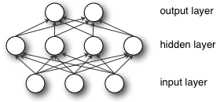
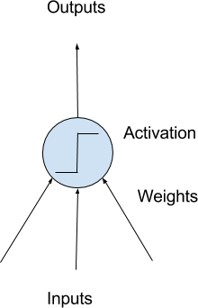

# 多层感知器分类（MLPClassifier）使用文档
| 组件名称 | 多层感知器分类（MLPClassifier） |  |  |
| --- | --- | --- | --- |
| 工具集 | 机器学习 |  |  |
| 组件作者 | 雪浪云-墨文 |  |  |
| 文档版本 | 1.0 |  |  |
| 功能 | 多层感知器分类（MLPClassifier） |  |  |
| 镜像名称 | ml_components:3 |  |  |
| 开发语言 | Python |  |  |

## 组件原理
多层感知器(MLP)是一种前馈人工神经网络。MLP至少由三层节点组成:输入层、隐藏层和输出层。除输入节点外，每个节点都是一个神经元，使用非线性激活函数。MLP使用一种称为反向传播的监督学习技术进行训练。多层结构和非线性激活函数将MLP与线性感知器区分开来。它可以识别非线性可分的数据。

多层感知器有时被通俗地称为“vanilla”神经网络，尤其是当它们只有一个隐藏层时。

单个隐含层的MLP可以用图形表示如下:

神经网络的构建单元是人工神经元。这些是简单的计算单元，具有加权的输入信号，并使用激活函数产生输出信号。

你可能熟悉线性分类，在多层感知器中，输入的权重非常类似于分类方程中使用的系数。就像线性分类一样，每个神经元也有一个偏差，这个偏差可以被认为是一个输入，它的值总是1.0，而且它也必须加权。例如，一个神经元可能有两个输入，在这种情况下它需要三个权重。每个输入一个，偏置一个。

权重通常被初始化为小的随机值，比如0到0.3之间的值，尽管可以使用更复杂的初始化方案。与线性分类一样，权重越大，表示复杂性和脆弱性越高。在网络中保持权值较小，可以采用正则化技术。

加权输入被求和并需要通过一个激活函数传递，有时称为传递函数。激活函数是神经元加权输入和输出的简单映射。它被称为激活函数，因为它控制着神经元被激活的阈值和输出信号的强度。

历史上简单的阶跃激活函数的使用场景是当求和输入高于阈值(例如0.5)时，神经元将输出1.0，否则将输出0.0。

激活函数通常使用非线性激活函数。这使得网络能够以更复杂的方式组合输入，从而为它们能够建模的函数提供更丰富的功能。使用了一些非线性函数，如logistic函数(也称为sigmoid函数)，它输出的值在0到1之间，呈s形分布，双曲正切函数(也称为tanh)在-1到+1范围内输出相同的分布。

根据近年来的研究表明，ReLU作为激活函数有更好的效果。
## 输入桩
支持单个csv文件输入。
### 输入端子1

- **端口名称**：训练数据
- **输入类型**：Csv文件
- **功能描述**： 输入用于训练的数据
## 输出桩
支持sklearn模型输出。
### 输出端子1

- **端口名称**：输出模型
- **输出类型**：sklearn模型
- **功能描述**： 输出训练好的模型用于预测
## 参数配置
### 隐藏层

- **功能描述**：第i个元素表示第i个隐藏层中的神经元数量。
- **必选参数**：是
- **默认值**：100
### 激活函数

- **功能描述**：选择激活函数，{‘identity’, ‘logistic’, ‘tanh’, ‘relu’}。
- **必选参数**：是
- **默认值**：relu
### solver

- **功能描述**：权重优化求解器。{‘lbfgs’, ‘sgd’, ‘adam’}。
- **必选参数**：是
- **默认值**：adam
### alpha

- **功能描述**：L2正则项参数。
- **必选参数**：是
- **默认值**：0.0001
### Batch Size

- **功能描述**：随机优化器的批大小。
- **必选参数**：是
- **默认值**：auto
### Learning Rate

- **功能描述**：学习率权重更新。{‘constant’, ‘invscaling’, ‘adaptive’}。
- **必选参数**：是
- **默认值**：constant
### Learning Rate Init

- **功能描述**：使用的初始学习率。
- **必选参数**：是
- **默认值**：0.001
### powerT

- **功能描述**：逆比例学习速率的指数。
- **必选参数**：是
- **默认值**：0.5	

### 最大迭代次数

- **功能描述**：最大迭代次数
- **必选参数**：是
- **默认值**：200
### shuffle

- **功能描述**：是否在每次迭代中进行洗牌。
- **必选参数**：是
- **默认值**：true
### Random State

- **功能描述**：随机种子。
- **必选参数**：否
- **默认值**：（无）
### tol

- **功能描述**：优化器的容忍度。
- **必选参数**：是
- **默认值**：0.0001
### verbose

- **功能描述**：是否将进度消息打印输出。
- **必选参数**：是
- **默认值**：false
### Warm Start

- **功能描述**：当设置为True时，重用前一个解决方案初始化，否则，只需擦除之前的解决方案。
- **必选参数**：是
- **默认值**：false
### momentum

- **功能描述**：梯度下降动量更新。
- **必选参数**：是
- **默认值**：0.9
### Nesterovs Momentum

- **功能描述**：是否使用Nesterov的动量更新。
- **必选参数**：是
- **默认值**：true
### Early Stop

- **功能描述**：当验证分数没有提高时，是否提早终止训练。
- **必选参数**：是
- **默认值**：false
### Validation Fraction

- **功能描述**：预留用于验证的训练数据的比例，用于提前停止。
- **必选参数**：是
- **默认值**：0.1
### beta1

- **功能描述**：adam中第一个矩向量估计的指数衰减率应该在[0,1]。
- **必选参数**：是
- **默认值**：0.9
### beta2

- **功能描述**：adam中二阶矩向量估计的指数衰减率应该在[0,1]。
- **必选参数**：是
- **默认值**：0.999
### epsilon

- **功能描述**：数值稳定性在adam中的值。
- **必选参数**：是
- **默认值**：1e-8
### N Iter No Change

- **功能描述**：不满足tol时的最大训练次数。
- **必选参数**：是
- **默认值**：10
### Max Fun

- **功能描述**：最大值
- **必选参数**：是
- **默认值**：15000
### 需要训练

- **功能描述**：该模型是否需要训练，默认为需要训练。
- **必选参数**：是
- **默认值**：true
### 特征字段

- **功能描述**：特征字段
- **必选参数**：是
- **默认值**：（无）
### 识别字段

- **功能描述**：识别字段
- **必选参数**：是
- **默认值**：（无）
## 使用方法
- 将组件拖入到项目中
- 与前一个组件输出的端口连接（必须是csv类型）
- 点击运行该节点

