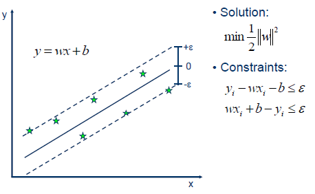

# 线性支持向量机分类（LinearSVC）使用文档
| 组件名称 | 线性支持向量机分类（LinearSVC） |  |  |
| --- | --- | --- | --- |
| 工具集 | 数据读写/本地数据 |  |  |
| 组件作者 | 雪浪云-墨文 |  |  |
| 文档版本 | 1.0 |  |  |
| 功能 | 线性支持向量机分类（LinearSVC）算法 |  |  |
| 镜像名称 | ml_components:3 |  |  |
| 开发语言 | Python |  |  |

## 组件原理

线性支持向量机回归属于算法组件中机器学习的一种回归组件。

在机器学习中，支持向量机(SVMs，也称为支持向量网络)是一种有关联学习算法的监督学习模型，支持分类和回归问题的数据建模。给定一组训练数据，每个样本属于一个或其他类别，用支持向量机算法构建并训练一个模型，将新样本分配到一个类别，使它成为一个非概率性二分类器。支持向量机模型是将样本表示为空间中的点，并将其映射，以便将不同类别的样本之间的间距尽可能大。然后，新的样本被映射到相同的空间中，并根据它们所处的位置，预测它们属于某个类别。

除了执行线性分类，支持向量机还可以通过使用核线方程有效地执行非线性分类，隐式地将它们的输入映射到高维特征空间。

当数据没有标记时，监督学习是不可能的，需要一种无监督学习方法，通过无监督学习试图找到数据到类别的自然聚类，然后将新数据映射到这些形成的类别。支持向量聚类算法是由Hava Siegelmann和Vladimir Vapnik共同创建的，它利用支持向量的统计量对未标注的数据进行分类，是工业应用中应用最广泛的聚类算法之一。

支持向量机也可以作为回归方法，保持算法的所有主要特征(最大边缘算法)。支持向量回归(SVR)使用与支持向量机相同的原则进行分类，只有一些细微的差异。首先，因为输出是一个连续值，所以很难预测，因为它有无限种可能性。在回归的情况下，容忍度(epsilon)被设置为支持向量机的近似值，算法将更加复杂。然而，其主要思想始终是相同的:为了最小化误差，使超平面的类别间距最大化，但是部分误差是可以容忍的。

## 输入桩
支持单个csv文件输入。
### 输出端子1

- **端口名称：** 训练数据
- **输出类型：** Csv文件
- **功能描述：** 输入用于训练的数据

## 输出桩
支持sklearn模型输出。
### 输出端子1

- **端口名称：** 输出模型
- **输出类型：** sklearn模型
- **功能描述：** 输出训练好的模型用于预测

## 参数配置

### penalty

- **功能描述：** ‘l1’ or ‘l2’ ，指定处罚中使用的规范
- **必选参数：** 是
- **默认值：** l2

### loss

- **功能描述：** ‘hinge’ or ‘squared_hinge’，损失函数
- **必选参数：** 是
- **默认值：** squared_hinge

### dual

- **功能描述：** 选择算法来解决对偶或原始优化问题
- **必选参数：** 是
- **默认值：** true

### tol

- **功能描述：** 算法停止的容忍度。
- **必选参数：** 是
- **默认值：** 0.0001

### C

- **功能描述：** 误差项的惩罚参数C。
- **必选参数：** 是
- **默认值：** 1

### 需要训练

- **功能描述：** 是否需要训练
- **必选参数：** 是
- **默认值：** true

### Fit Intercept

- **功能描述：** 是否计算该模型的截距。
- **必选参数：** 是
- **默认值：** true

### Intercept Scaling

- **功能描述：** 为了减少正则化对合成特征权重(截距)的影响，必须增加Intercept Scaling。
- **必选参数：** 是
- **默认值：** 1

### verbose

- **功能描述：** 启用详细输出。
- **必选参数：** 是
- **默认值：** 0

### Random State

- **功能描述：** 随机种子。
- **必选参数：** 否
- **默认值：** （无）

### Max Iter

- **功能描述：** 要运行的最大迭代数。
- **必选参数：** 是
- **默认值：** 1000

### multi_class

- **功能描述：** 如果y包含两个以上的类，则确定多类策略。
- **必选参数：** 是
- **默认值：** ovr

### 特征字段

- **功能描述：** 特征字段
- **必选参数：** 是
- **默认值：** （无）

### 识别字段

- **功能描述：** 目标字段
- **必选参数：** 是
- **默认值：** （无）

## 使用方法
- 加组件拖入到项目中
- 与前一个组件输出的端口连接（必须是csv类型）
- 点击运行该节点

