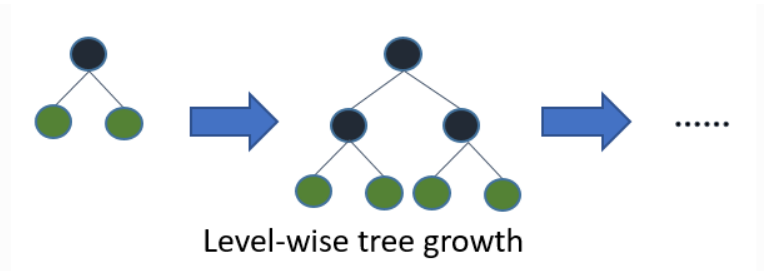
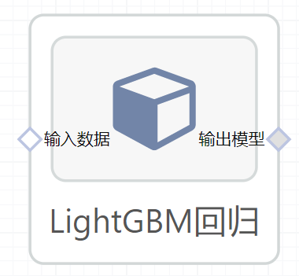

# LightGBM回归使用文档
| 组件名称 | LightGBM回归|  |  |
| --- | --- | --- | --- |
| 工具集 | 机器学习 |  |  |
| 组件作者 | 雪浪云-墨文 |  |  |
| 文档版本 | 1.0 |  |  |
| 功能 | LightGBM回归算法|  |  |
| 镜像名称 | ml_components:3 |  |  |
| 开发语言 | Python |  |  |

## 组件原理
GBDT (Gradient Boosting Decision Tree) 是机器学习中一个长盛不衰的模型，其主要思想是利用弱分类器（决策树）迭代训练以得到最优模型，该模型具有训练效果好、不易过拟合等优点。GBDT不仅在工业界应用广泛，通常被用于多分类、点击率预测、搜索排序等任务；在各种数据挖掘竞赛中也是致命武器，据统计Kaggle上的比赛有一半以上的冠军方案都是基于GBDT。而LightGBM（Light Gradient Boosting Machine）是一个实现GBDT算法的框架，支持高效率的并行训练，并且具有更快的训练速度、更低的内存消耗、更好的准确率、支持分布式可以快速处理海量数据等优点。

常用的机器学习算法，例如神经网络等算法，都可以以mini-batch的方式训练，训练数据的大小不会受到内存限制。而GBDT在每一次迭代的时候，都需要遍历整个训练数据多次。如果把整个训练数据装进内存则会限制训练数据的大小；如果不装进内存，反复地读写训练数据又会消耗非常大的时间。尤其面对工业级海量的数据，普通的GBDT算法是不能满足其需求的。

LightGBM提出的主要原因就是为了解决GBDT在海量数据遇到的问题，让GBDT可以更好更快地用于工业实践。

在Histogram算法之上，LightGBM进行进一步的优化。首先它抛弃了大多数GBDT工具使用的按层生长 (level-wise) 的决策树生长策略，而使用了带有深度限制的按叶子生长 (leaf-wise) 算法。

XGBoost 采用 Level-wise 的增长策略，该策略遍历一次数据可以同时分裂同一层的叶子，容易进行多线程优化，也好控制模型复杂度，不容易过拟合。但实际上Level-wise是一种低效的算法，因为它不加区分的对待同一层的叶子，实际上很多叶子的分裂增益较低，没必要进行搜索和分裂，因此带来了很多没必要的计算开销。

LightGBM采用Leaf-wise的增长策略，该策略每次从当前所有叶子中，找到分裂增益最大的一个叶子，然后分裂，如此循环。因此同Level-wise相比，Leaf-wise的优点是：在分裂次数相同的情况下，Leaf-wise可以降低更多的误差，得到更好的精度；Leaf-wise的缺点是：可能会长出比较深的决策树，产生过拟合。因此LightGBM会在Leaf-wise之上增加了一个最大深度的限制，在保证高效率的同时防止过拟合。

## 输入桩
支持单个csv文件输入。
### 输入端子1

- **端口名称**：训练数据
- **输入类型**：Csv文件
- **功能描述**： 输入用于训练的数据
## 输出桩
支持sklearn模型输出。
### 输出端子1

- **端口名称**：输出模型
- **输出类型**：sklearn模型
- **功能描述**： 输出训练好的模型用于预测
## 参数配置
### 增强类型

- **功能描述**：增强类型
- **必选参数**：是
- **默认值**：gbdt
### 树的最大叶节点数量

- **功能描述**：树的最大叶节点数量
- **必选参数**：是
- **默认值**：31
### 最大深度

- **功能描述**：树的最大深度
- **必选参数**：是
- **默认值**：500
### 学习率

- **功能描述**：增强学习率
- **必选参数**：是
- **默认值**：0.1
### 增强树的数量

- **功能描述**：需要拟合的增强树的数量
- **必选参数**：是
- **默认值**：100
### 构建分桶的样本数量

- **功能描述**：构建分桶的样本数量
- **必选参数**：是
- **默认值**：20000
### 最小损失减少

- **功能描述**：在树的叶节点上进行进一步分区所需的最小损失减少
- **必选参数**：是
- **默认值**：1
### 叶子节点所需的实例权重的最小和

- **功能描述**：叶子节点所需的实例权重的最小和
- **必选参数**：是
- **默认值**：0.001
### 叶子节点所需的最小样本数

- **功能描述**：叶子节点所需的最小样本数
- **必选参数**：是
- **默认值**：20
### 训练样本比例

- **功能描述**：训练样本比例
- **必选参数**：是
- **默认值**：1
### 样本的频率

- **功能描述**：小于0代表没有激活
- **必选参数**：是
- **默认值**：0
### 构建每棵树时列的样本比率

- **功能描述**：构建每棵树时列的样本比率
- **必选参数**：是
- **默认值**：1
### L1正则化

- **功能描述**：L1正则化
- **必选参数**：是
- **默认值**：0
### L2正则化

- **功能描述**：L2正则化
- **必选参数**：是
- **默认值**：0
### 特征重要性类型

- **功能描述**：特征重要性类型
- **必选参数**：是
- **默认值**：true
### 需要训练

- **功能描述**：该模型是否需要训练，默认为需要训练。
- **必选参数**：是
- **默认值**：true
### 特征字段

- **功能描述**：特征字段
- **必选参数**：是
- **默认值**：（无）
### 识别字段

- **功能描述**：识别字段
- **必选参数**：是
- **默认值**：（无）
## 使用方法
- 将组件拖入到项目中
- 与前一个组件输出的端口连接（必须是csv类型）
- 点击运行该节点

