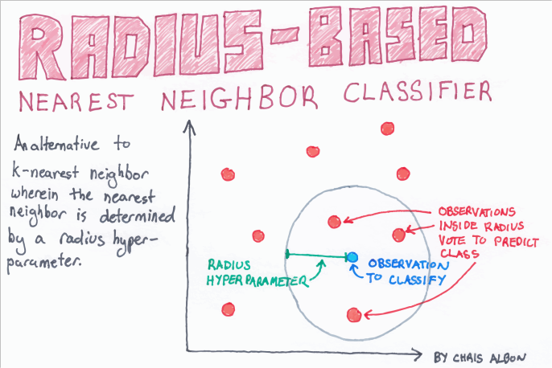
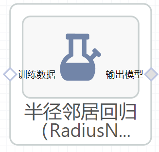

# 半径邻居回归（RadiusNeighborsRegressor）使用文档
| 组件名称 | 半径邻居回归（RadiusNeighborsRegressor） |  |  |
| --- | --- | --- | --- |
| 工具集 | 机器学习 |  |  |
| 组件作者 | 雪浪云-墨文 |  |  |
| 文档版本 | 1.0 |  |  |
| 功能 | 半径邻居回归（RadiusNeighborsRegressor）|  |  |
| 镜像名称 | ml_components:3 |  |  |
| 开发语言 | Python |  |  |

## 组件原理
在计算几何中，固定半径近邻问题是最近邻搜索问题的一种变体。在固定半径邻域问题中,一种是给定一组输入点，在d维空间中并有固定的距离。另一种必须设计一个数据结构,给定一个查询点,快速有效的查询数据结构内的点间距。问题长期以来被研究;Bentley(1975)引用了Levinthal 1966年的一篇论文，该论文将该技术作为分子结构可视化系统的一部分，并有许多其他应用。

解决这个问题的一个方法是在指向一个整数格,这样网格点之间的距离Δ就是所需的距离。可以使用一个哈希表,对每个输入点,附近的其他输入映射到网格点,然后可以检测是否不四舍五入的位置实际上是距离Δ。当维度为固定常数时，该程序测试的点对数的个数与测试所用时间是线性的。然而，线性时间界的比例常数随维数呈指数增长。利用该方法，可以在线性时间内从几何数据构造无差异图和单位盘图。

现代GPU并行方法能够有效地计算出所有对固定半径的NNS。对于有限域，格林方法表明，该问题可以通过在均匀网格上排序来解决，即在O(kn)时间内找到所有粒子的所有邻居，其中k与邻居的平均数量成正比。Hoetzlein通过计数、排序和原子操作在现代硬件上进一步改进了这一点。

在连续拉格朗日模拟(如光滑粒子流体动力学)、计算几何和点云问题(表面重建)中，常出现固定半径的邻近问题。

## 输入桩
支持单个csv文件输入。
### 输入端子1

- **端口名称**：训练数据
- **输入类型**：Csv文件
- **功能描述**： 输入用于训练的数据
## 输出桩
支持sklearn模型输出。
### 输出端子1

- **端口名称**：输出模型
- **输出类型**：sklearn模型
- **功能描述**： 输出训练好的模型用于预测
## 参数配置
### radius

- **功能描述**：radius_neighbors默认使用的参数空间范围。
- **必选参数**：是
- **默认值**：5
### weights

- **功能描述**：用于预测的权函数。uniform，distance。
- **必选参数**：是
- **默认值**：uniform
### algorithm

- **功能描述**：计算最近邻的算法。‘auto’, ‘ball_tree’, ‘kd_tree’, ‘brute’。
- **必选参数**：是
- **默认值**：auto
### Leaf Size

- **功能描述**:传递给巴利树或KDTree的叶大小。
- **必选参数**：是
- **默认值**：30
### p

- **功能描述**: Minkowski度量的幂参数。
- **必选参数**：是
- **默认值**：2
### metric

- **功能描述**: 树的距离度量标准。
- **必选参数**：是
- **默认值**：minkowski
### N Jobs

- **功能描述**: 为邻居搜索运行的并行作业数。
- **必选参数**：否
- **默认值**：（无）
### 需要训练

- **功能描述**：该模型是否需要训练，默认为需要训练。
- **必选参数**：是
- **默认值**：true
### 特征字段

- **功能描述**：特征字段
- **必选参数**：是
- **默认值**：（无）
### 识别字段

- **功能描述**：识别字段
- **必选参数**：是
- **默认值**：（无）
## 使用方法
- 将组件拖入到项目中
- 与前一个组件输出的端口连接（必须是csv类型）
- 点击运行该节点

