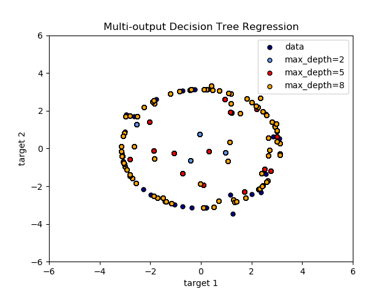

#多输出回归（MultiOutputRegressor）使用文档
| 组件名称 | 多输出回归（MultiOutputRegressor）|  |  |
| --- | --- | --- | --- |
| 工具集 | 机器学习 |  |  |
| 组件作者 | 雪浪云-墨文 |  |  |
| 文档版本 | 1.0 |  |  |
| 功能 | 多输出回归（MultiOutputRegressor）算法|  |  |
| 镜像名称 | ml_components:3 |  |  |
| 开发语言 | Python |  |  |

## 组件原理
机器学习分类器通常支持单个目标变量。在回归模型中，目标是实值，而在分类模型中，目标是二进制或多值的。对于分类模型，多目标变量的问题称为多标签分类。

- 简单回归模型是试图用单个解释变量/自变量来拟合线性回归模型的模型。
- 多元回归模型是根据两个或两个以上自变量的值来预测因变量的模型。例如:是否可以根据吸烟时间、开始吸烟的年龄、收入、性别等预测每天的香烟消费量。
- 多目标回归是指存在多个因变量时所使用的术语。如果目标变量是分类的，则称为多标签或多目标分类;如果目标变量是数值的，则通常使用多目标(或多输出)回归。

## 输入桩
支持单个csv文件输入。
### 输入端子1

- **端口名称**：训练数据
- **输入类型**：Csv文件
- **功能描述**： 输入用于训练的数据
### 输入端子2

- **端口名称**：输入模型
- **输入类型**：sklearn模型
- **功能描述**： 输入用于训练的模型
## 输出桩
支持sklearn模型输出。
### 输出端子1

- **端口名称**：输出模型
- **输出类型**：sklearn模型
- **功能描述**： 输出训练好的模型用于预测
## 参数配置
### strategy

- **功能描述**:多输出回归策略。multi_regressor，regressor_chain。
- **必选参数**：是
- **默认值**：1000
### N Jobs

- **功能描述**:运行的并行作业数。
- **必选参数**：否
- **默认值**：（无）
### 需要训练

- **功能描述**：该模型是否需要训练，默认为需要训练。
- **必选参数**：是
- **默认值**：true
### 特征字段

- **功能描述**：特征字段
- **必选参数**：是
- **默认值**：（无）
### 识别字段

- **功能描述**：识别字段
- **必选参数**：是
- **默认值**：（无）
## 使用方法
- 将组件拖入到项目中
- 与前一个组件输出的端口连接（必须是csv类型）
- 点击运行该节点

