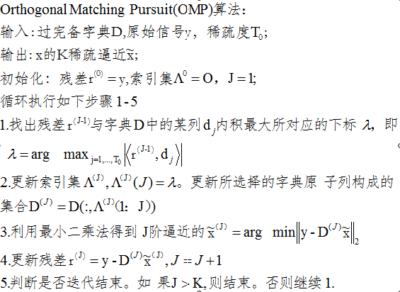

# 带交叉验证的正交匹配追踪回归（OrthogonalMatchingPursuitCV）使用文档
| 组件名称 |带交叉验证的正交匹配追踪回归（OrthogonalMatchingPursuitCV）|  |  |
| --- | --- | --- | --- |
| 工具集 | 机器学习 |  |  |
| 组件作者 | 雪浪云-墨文 |  |  |
| 文档版本 | 1.0 |  |  |
| 功能 | 带交叉验证的正交匹配追踪回归（OrthogonalMatchingPursuitCV）算法|  |  |
| 镜像名称 | ml_components:3 |  |  |
| 开发语言 | Python |  |  |

## 组件原理
交叉验证，有的时候也称作循环估计（Rotation Estimation），是一种统计学上将数据样本切割成较小子集的实用方法，该理论是由Seymour Geisser提出的。在给定的建模样本中，拿出大部分样本进行建模型，留小部分样本用刚建立的模型进行预报，并求这小部分样本的预报误差，记录它们的平方加和。这个过程一直进行，直到所有的样本都被预报了一次而且仅被预报一次。把每个样本的预报误差平方加和，称为PRESS(predicted Error Sum of Squares)。

交叉验证的基本思想是把在某种意义下将原始数据(dataset)进行分组,一部分做为训练集(train set)，另一部分做为验证集(validation set or test set)。首先用训练集对分类器进行训练，再利用验证集来测试训练得到的模型(model)，以此来做为评价分类器的性能指标。

正交匹配追踪回归（OrthogonalMatchingPursuit）算法的本质思想是：以贪婪迭代的方法选择D的列，使得在每次迭代的过程中所选择的列与当前冗余向量最大程度的相关，从原始信号向量中减去相关部分并反复迭代，只到迭代次数达到稀疏度K，停止迭代。

核心算法步骤如下：

## 输入桩
支持单个csv文件输入。
### 输入端子1

- **端口名称**：训练数据
- **输入类型**：Csv文件
- **功能描述**： 输入用于训练的数据
## 输出桩
支持sklearn模型输出。
### 输出端子1

- **端口名称**：输出模型
- **输出类型**：sklearn模型
- **功能描述**： 输出训练好的模型用于预测
## 参数配置
### Copy

- **功能描述**：矩阵X是否一定要被算法复制。只有当X已经是Fortran排序的，False值才会生效，否则无论如何都会生成一个副本。
- **必选参数**：是
- **默认值**：true
### Fit Intercept

- **功能描述**:：是否计算模型截距
- **必选参数**：是
- **默认值**：true
### 是否进行归一化

- **功能描述**：是否对数据进行归一化处理，该参数在Fit Intercept参数设为False时会被忽略。
- **必选参数**：是
- **默认值**：true
### 最大迭代次数

- **功能描述**：模型训练中的最大迭代次数
- **必选参数**：是
- **默认值**：500
### cv

- **功能描述**：交叉验证拆分数量
- **必选参数**：是
- **默认值**：5
### 并行度

- **功能描述**：交叉验证时使用的CPU核数
- **必选参数**：否
- **默认值**：（无）
### 需要训练

- **功能描述**：该模型是否需要训练，默认为需要训练。
- **必选参数**：是
- **默认值**：true
### 特征字段

- **功能描述**：特征字段
- **必选参数**：是
- **默认值**：（无）
### 识别字段

- **功能描述**：识别字段
- **必选参数**：是
- **默认值**：（无）
## 使用方法
- 将组件拖入到项目中
- 与前一个组件输出的端口连接（必须是csv类型）
- 点击运行该节点

