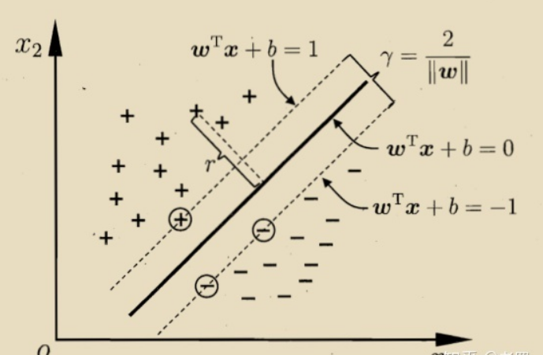
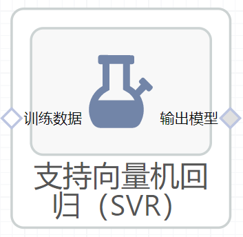

# 支持向量机回归（SVR）使用文档
| 组件名称 | 支持向量机回归（SVR）|  |  |
| --- | --- | --- | --- |
| 工具集 | 机器学习 |  |  |
| 组件作者 | 雪浪云-墨文 |  |  |
| 文档版本 | 1.0 |  |  |
| 功能 | 支持向量机回归（SVR）算法|  |  |
| 镜像名称 | ml_components:3 |  |  |
| 开发语言 | Python |  |  |

## 组件原理
支持向量机（ SVM ）是一种比较好的实现了结构风险最小化思想的方法。它的机器学习策略是结构风险最小化原则 为了最小化期望风险，应同时最小化经验风险和置信范围）

支持向量机方法的基本思想：

- 它是专门针对有限样本情况的学习机器，实现的是结构风险最小化：在对给定的数据逼近的精度与逼近函数的复杂性之间寻求折衷，以期获得最好的推广能力；
- 它最终解决的是一个凸二次规划问题，从理论上说，得到的将是全局最优解，解决了在神经网络方法中无法避免的局部极值问题；
- 它将实际问题通过非线性变换转换到高维的特征空间，在高维空间中构造线性决策函数来实现原空间中的非线性决策函数，巧妙地解决了维数问题，并保证了有较好的推广能力，而且算法复杂度与样本维数无关。

目前， SVM 算法在模式识别、回归估计、概率密度函数估计等方面都有应用，且算法在效率与精度上已经超过传统的学习算法或与之不相上下。  

支持向量回归算法：通过升维后，在高维空间中构造线性决策函数来实现线性回归，用e不敏感函数时，其基础主要是 e 不敏感函数和核函数算法。

若将拟合的数学模型表达多维空间的某一曲线，则根据e 不敏感函数所得的结果，就是包括该曲线和训练点的“ e管道”。在所有样本点中，只有分布在“管壁”上的那一部分样本点决定管道的位置。这一部分训练样本称为“支持向量”。为适应训练样本集的非线性，传统的 拟合方法通常是在线性方程后面加高阶项。此法诚然有效，但由此增加的可调参数未免增加了过拟合的风险。支持向量回归算法采用核函数解决这一矛盾。用核函数 代替线性方程中的线性项可以使原来的线性算法“非线性化”，即能做非线性回归。与此同时，引进核函数达到了“升维”的目的，而增加的可调参数是过拟合依然 能控制。	

## 输入桩
支持单个csv文件输入。
### 输入端子1

- **端口名称**：训练数据
- **输入类型**：Csv文件
- **功能描述**： 输入用于训练的数据
## 输出桩
支持sklearn模型输出。
### 输出端子1

- **端口名称**：输出模型
- **输出类型**：sklearn模型
- **功能描述**： 输出训练好的模型用于预测
## 参数配置
### kernel

- **功能描述**：指定要在算法中使用的内核类型。‘linear’, ‘poly’, ‘rbf’, ‘sigmoid’, ‘precomputed’中的一种。
- **必选参数**：是
- **默认值**：rbf
### degree

- **功能描述**:多项式核函数的次数(' poly ')。
- **必选参数**：是
- **默认值**：3
### gamma

- **功能描述**:' rbf '， ' poly '和' sigmoid '的核系数
- **必选参数**：是
- **默认值**：scale
### coef0

- **功能描述**：核函数中的独立项。
- **必选参数**：是
- **默认值**：0
### shrinking

- **功能描述**：是否使用收缩启发式。
- **必选参数**：是
- **默认值**：true
### probability

- **功能描述**：是否启用概率估计
- **必选参数**：是
- **默认值**：false
### tol

- **功能描述**：停止的容忍度。
- **必选参数**：是
- **默认值**：0.001
### C

- **功能描述**：训练误差分数的上界和支持向量分数的下界。(0, 1]
- **必选参数**：是
- **默认值**：1
### epsilon

- **功能描述**：epsilon-SVR模型中的epsilon参数
- **必选参数**：是
- **默认值**：0.1
### Cache Size

- **功能描述**：指定内核缓存的大小(以MB为单位)。
- **必选参数**：否
- **默认值**：（无）
### verbose

- **功能描述**：启用详细输出。
- **必选参数**：是
- **默认值**：false
### Max Iter

- **功能描述**：要运行的最大迭代数。
- **必选参数**：是
- **默认值**：100
### Decision Fcuntion Shape

- **功能描述**：决策函数返回数据形状，‘ovr’或‘ovo’
- **必选参数**：是
- **默认值**：ovr
### Random State

- **功能描述**：随机种子
- **必选参数**：否
- **默认值**：（无）
### 需要训练

- **功能描述**：该模型是否需要训练，默认为需要训练。
- **必选参数**：是
- **默认值**：true
### 特征字段

- **功能描述**：特征字段
- **必选参数**：是
- **默认值**：（无）
### 识别字段

- **功能描述**：识别字段
- **必选参数**：是
- **默认值**：（无）
## 使用方法
- 将组件拖入到项目中
- 与前一个组件输出的端口连接（必须是csv类型）
- 点击运行该节点

