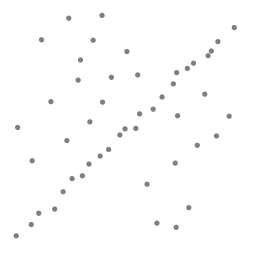
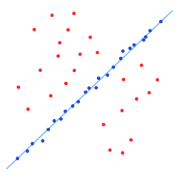
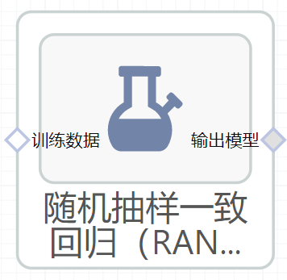

# 随机抽样一致回归（RANSACRegressor）使用文档
| 组件名称 |随机抽样一致回归（RANSACRegressor）|  |  |
| --- | --- | --- | --- |
| 工具集 | 机器学习 |  |  |
| 组件作者 | 雪浪云-墨文 |  |  |
| 文档版本 | 1.0 |  |  |
| 功能 | 随机抽样一致回归（RANSACRegressor）算法|  |  |
| 镜像名称 | ml_components:3 |  |  |
| 开发语言 | Python |  |  |

## 组件原理
RANSAC算法的输入是一组观测数据（往往含有较大的噪声或无效点），它是一种重采样技术（resampling technique），通过估计模型参数所需的最小的样本点数，来得到备选模型集合，然后在不断的对集合进行扩充，其算法步骤为：

- 随机的选择估计模型参数所需的最少的样本点。

- 估计出模型的参数。

- 找出在误差 ϵ 内，有多少点适合当前这个模型，并将这些点标记为模型内点

- 如果内点的数目占总样本点的比例达到了事先设定的阈值 τ，那么基于这些内点重新估计模型的参数，并以此为最终模型， 终止程序。

- 否则重复执行1到4步。

RANSAC算法是从输入样本集合的内点的随机子集中学习模型。

RANSAC算法是一个非确定性算法（non-deterministic algorithm），这个算法只能得以一定的概率得到一个还不错的结果，在基本模型已定的情况下，结果的好坏程度主要取决于算法最大的迭代次数。

RANSAC算法在线性和非线性回归中都得到了广泛的应用，而其最典型也是最成功的应用，莫过于在图像处理中处理图像拼接问题，这部分在Opencv中有相关的实现。

从总体上来讲，RANSAC算法将输入样本分成了两个大的子集：内点（inliers）和外点（outliers）。其中内点的数据分布会受到噪声的影响；而外点主要来自于错误的测量手段或者是对数据错误的假设。而RANSAC算法最终的结果是基于算法所确定的内点集合得到的。

下图是包含很多局外点的数据集

下图是RANSAC找到的直线（局外点并不影响结果）

## 输入桩
支持单个csv文件输入。
### 输入端子1

- **端口名称**：训练数据
- **输入类型**：Csv文件
- **功能描述**： 输入用于训练的数据
## 输出桩
支持sklearn模型输出。
### 输出端子1

- **端口名称**：输出模型
- **输出类型**：sklearn模型
- **功能描述**： 输出训练好的模型用于预测
## 参数配置
### 最小样本数

- **功能描述**：从原始数据中随机选择的最小样本数
- **必选参数**：否
- **默认值**：（无）
### 残差阈值

- **功能描述**:：能够分类为有关联的数据样本的最大残差
- **必选参数**：否
- **默认值**：（无）
### 最大迭代次数

- **功能描述**：随机样本选择的最大迭代次数
- **必选参数**：是
- **默认值**：100
### 最大跳过次数

- **功能描述**：由于发现零个内联或无效数据，可以跳过的最大迭代次数
- **必选参数**：否
- **默认值**：（无）
### 内联数量

- **功能描述**：如果至少找到这个数量的内联数据，则停止迭代
- **必选参数**：否
- **默认值**：(无)
### 得分阈值

- **功能描述**：如果分数大于或等于此阈值，则停止迭代
- **必选参数**：否
- **默认值**：（无）
### Stop Probability

- **功能描述**：如果在RANSAC中至少有一组无异常值的训练数据被采样，则RANSAC迭代停止
- **必选参数**：是
- **默认值**：0.99
### 损失函数

- **功能描述**：训练时使用的损失函数
- **必选参数**：是
- **默认值**：absolute_loss
### 需要训练

- **功能描述**：该模型是否需要训练，默认为需要训练。
- **必选参数**：是
- **默认值**：true
### 特征字段

- **功能描述**：特征字段
- **必选参数**：是
- **默认值**：（无）
### 识别字段

- **功能描述**：识别字段
- **必选参数**：是
- **默认值**：（无）
## 使用方法
- 将组件拖入到项目中
- 与前一个组件输出的端口连接（必须是csv类型）
- 点击运行该节点

