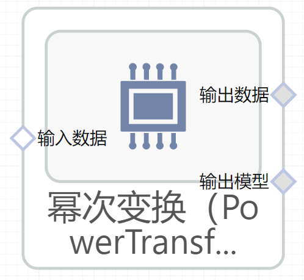

# 幂次变换（PowerTransformer）使用文档
| 组件名称 | 幂次变换（PowerTransformer）|  |  |
| --- | --- | --- | --- |
| 工具集 | 机器学习 |  |  |
| 组件作者 | 雪浪云-墨文 |  |  |
| 文档版本 | 1.0 |  |  |
| 功能 |幂次变换（PowerTransformer）算法 |  |  |
| 镜像名称 | ml_components:3 |  |  |
| 开发语言 | Python |  |  |

## 组件原理
利用幂变换的特点，使数据更符合高斯分布。

幂变换是一族参数化的单调变换，用于使数据变得更符合高斯分布。这对于建模与异方差(非常数方差)相关的问题或其他需要正态分布的情况很有用。

目前，Power转换器支持Box-Cox变换和Yeo-Johnson变换.利用极大似然估计稳定方差和最小偏度的最优参数。

Box-Cox要求输入数据严格为正数据，而Yeo-Johnson支持正负数据。

默认情况下，对转换后的数据采用零均值、单位方差归一化。
## 输入桩
支持单个csv文件输入。
### 输入端子1

- **端口名称：** 训练数据
- **输出类型：** Csv文件
- **功能描述：** 输入用于训练的数据

## 输出桩
支持Csv文件输出。
### 输出端子1

- **端口名称：** 输出数据
- **输出类型：** Csv文件
- **功能描述：** 输出处理后的结果数据
### 输出端子2

- **端口名称：** 输出模型
- **输出类型：** sklearn文件
- **功能描述：** 输出训练后的模型
## 参数配置
### 方法

- **功能描述：** 进行幂次变换的方法
- **必选参数：** 是
- **默认值：** yeo-johnson
### 归一化

- **功能描述：** 应用零均值、单位方差归一化
- **必选参数：** 是
- **默认值：** true
### 目标字段

- **功能描述：** 目标字段
- **必选参数：** 是
- **默认值：** （无）

## 使用方法
- 加组件拖入到项目中
- 与前一个组件输出的端口连接（必须是csv类型）
- 点击运行该节点

