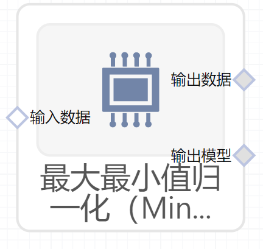

# 最大最小值归一化（MinMaxScaler）使用文档
| 组件名称 | 最大最小值归一化（MinMaxScaler）|  |  |
| --- | --- | --- | --- |
| 工具集 | 机器学习 |  |  |
| 组件作者 | 雪浪云-墨文 |  |  |
| 文档版本 | 1.0 |  |  |
| 功能 |最大最小值归一化（MinMaxScaler）算法 |  |  |
| 镜像名称 | ml_components:3 |  |  |
| 开发语言 | Python |  |  |

## 组件原理
通过将每个特征缩放到给定的范围来转换特征。

该估计器分别对每个特征进行缩放，使其在训练集上的给定范围内，例如在0到1之间。

这种转换通常被用作零均值、单位方差缩放的替代方法。
## 输入桩
支持单个csv文件输入。
### 输入端子1

- **端口名称：** 训练数据
- **输出类型：** Csv文件
- **功能描述：** 输入用于训练的数据

## 输出桩
支持Csv文件输出。
### 输出端子1

- **端口名称：** 输出数据
- **输出类型：** Csv文件
- **功能描述：** 输出处理后的结果数据
### 输出端子2

- **端口名称：** 输出模型
- **输出类型：** sklearn文件
- **功能描述：** 输出训练后的模型
## 参数配置
### 最大值

- **功能描述：** 转换后数据的最大值
- **必选参数：** 是
- **默认值：** 1
### 最小值

- **功能描述：** 转换后数据的最小值
- **必选参数：** 是
- **默认值：** 0
### 目标字段

- **功能描述：** 目标字段
- **必选参数：** 是
- **默认值：** （无）

## 使用方法
- 加组件拖入到项目中
- 与前一个组件输出的端口连接（必须是csv类型）
- 点击运行该节点

