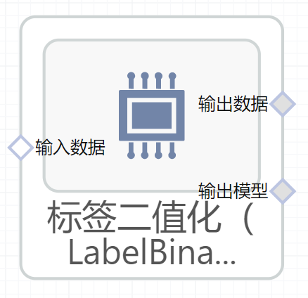

# 标签二值化（LabelBinarizer）使用文档
| 组件名称 | 标签二值化（LabelBinarizer）|  |  |
| --- | --- | --- | --- |
| 工具集 | 机器学习 |  |  |
| 组件作者 | 雪浪云-墨文 |  |  |
| 文档版本 | 1.0 |  |  |
| 功能 |标签二值化（LabelBinarizer）算法 |  |  |
| 镜像名称 | ml_components:3 |  |  |
| 开发语言 | Python |  |  |

## 组件原理
几个回归和二进制分类算法是有效的机器学习算法。将这些算法扩展到多类分类情况的一个简单方法是使用1-VALL方案。

在机器学习时，这仅仅是每个类的一个回归器或二进制分类器。需要将多类标签转换为二进制标签(属于或不属于类)。LabelBinarizer通过转换方法使这一过程更加容易。

在预测时，分配相应的模型给出最大可信度的类。LabelBinarizer通过反变换方法简化了这一点。
## 输入桩
支持单个csv文件输入。
### 输入端子1

- **端口名称：** 训练数据
- **输出类型：** Csv文件
- **功能描述：** 输入用于训练的数据

## 输出桩
支持Csv文件输出。
### 输出端子1

- **端口名称：** 输出数据
- **输出类型：** Csv文件
- **功能描述：** 输出处理后的结果数据
### 输出端子2

- **端口名称：** 输出模型
- **输出类型：** sklearn文件
- **功能描述：** 输出训练后的模型
## 参数配置
### 正标签

- **功能描述：** 正标签所使用的值
- **必选参数：** 是
- **默认值：** 1
### 负标签

- **功能描述：** 负标签所使用的值
- **必选参数：** 是
- **默认值：** -1
### 目标字段

- **功能描述：** 目标字段
- **必选参数：** 是
- **默认值：** （无）
### 生成字段

- **功能描述：** 生成字段
- **必选参数：** 是
- **默认值：** （无）
## 使用方法
- 加组件拖入到项目中
- 与前一个组件输出的端口连接（必须是csv类型）
- 点击运行该节点

