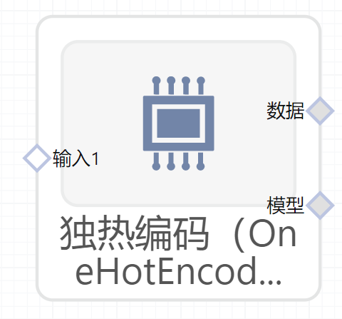

# 独热编码（OneHotEncoder）使用文档
| 组件名称 | 独热编码（OneHotEncoder）|  |  |
| --- | --- | --- | --- |
| 工具集 | 机器学习 |  |  |
| 组件作者 | 雪浪云-墨文 |  |  |
| 文档版本 | 1.0 |  |  |
| 功能 |独热编码（OneHotEncoder）算法 |  |  |
| 镜像名称 | ml_components:3 |  |  |
| 开发语言 | Python |  |  |

## 组件原理
将分类功能编码为一个单一热点的数字数组。

这个转换器的输入应该是一个类似数组的整数或字符串，表示由分类(离散)特性获得的值。这些特征是使用一个热(又称‘一个-K’或‘虚拟’)编码方案编码的。这将为每个类别创建一个二进制列，并返回稀疏矩阵或密集数组(取决于sparse参数)。

默认情况下，编码器根据每个功能中的唯一值派生类别。或者也可以指定categories手动。

这种编码是必要的，以提供分类数据给线性模型和支持向量机与标准内核。
## 输入桩
支持单个csv文件输入。
### 输入端子1

- **端口名称：** 训练数据
- **输出类型：** Csv文件
- **功能描述：** 输入用于训练的数据

## 输出桩
支持Csv文件输出。
### 输出端子1

- **端口名称：** 输出数据
- **输出类型：** Csv文件
- **功能描述：** 输出处理后的结果数据
### 输出端子2

- **端口名称：** 输出模型
- **输出类型：** sklearn文件
- **功能描述：** 输出训练后的模型
## 参数配置
### 未知处理

- **功能描述：** 转换过程中存在未知的分类的处理方法
- **必选参数：** 是
- **默认值：** error
### 目标字段

- **功能描述：** 目标字段
- **必选参数：** 是
- **默认值：** （无）
### 生成字段

- **功能描述：** 生成字段
- **必选参数：** 是
- **默认值：** （无）
## 使用方法
- 加组件拖入到项目中
- 与前一个组件输出的端口连接（必须是csv类型）
- 点击运行该节点

