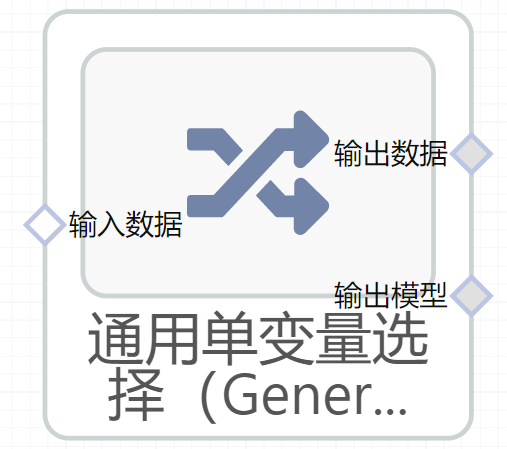

# 通用单变量选择（GenericUnivariateSelect）使用文档
| 组件名称 | 通用单变量选择（GenericUnivariateSelect）|  |  |
| --- | --- | --- | --- |
| 工具集 | 机器学习 |  |  |
| 组件作者 | 雪浪云-墨文 |  |  |
| 文档版本 | 1.0 |  |  |
| 功能 |通用单变量选择（GenericUnivariateSelect）算法 |  |  |
| 镜像名称 | ml_components:3 |  |  |
| 开发语言 | Python |  |  |

## 组件原理
具有可配置策略的单变量特征选择器。单变量特征选择的方法是根据某些统计检验的方法分别对每一个变量进行检验，得到一组分数和P-value数据，然后经过排序之后选择分数最高或者P-value最小的那些特征。
## 输入桩
支持单个csv文件输入。
### 输入端子1

- **端口名称：** 训练数据
- **输出类型：** Csv文件
- **功能描述：** 输入用于训练的数据

## 输出桩
支持Csv文件输出。
### 输出端子1

- **端口名称：** 输出数据
- **输出类型：** Csv文件
- **功能描述：** 输出处理后的结果数据
### 输出端子2

- **端口名称：** 输出模型
- **输出类型：** sklearn文件
- **功能描述：** 输出训练后的模型
## 参数配置
### 记分函数

- **功能描述：** 记分函数
- **必选参数：** 是
- **默认值：** f_classif
### 模式

- **功能描述：** 特征选择模式
- **必选参数：** 是
- **默认值：** percentile
### 参数

- **功能描述：** 相应选择模式的参数
- **必选参数：** 是
- **默认值：** 0.00005
### 特征字段

- **功能描述：** 特征字段
- **必选参数：** 是
- **默认值：** （无）
### 标签字段

- **功能描述：** 标签字段
- **必选参数：** 是
- **默认值：** （无）
### 输出字段

- **功能描述：** 输出字段
- **必选参数：** 是
- **默认值：** （无）

## 使用方法
- 加组件拖入到项目中
- 与前一个组件输出的端口连接（必须是csv类型）
- 点击运行该节点

