<div style="witdh:100%;">

<div style="float:right;margin-top:0px;">
    	算盘 C SDK User Manual 
    </div>
</div>

<div style="height:400px;">
</div>
<div style="text-align:center;font-size:35px;color:#C03">
算盘 C SDK User Manual 
</div>

<div style="height:100px;">
</div>

<div style="text-align:center;font-size:20px;color:#000">
Copyright © 2021 Xuelangyun Inc.<br /> All Rights Reserved.
</div>

<div style="height:180px;">
</div>
<div style="text-align:cente;color:#000;width:100%;padding-left:30px;padding-right:30px;">
This document is property of Xuelangyun Corporation Transmittal, receipt, or possession of this document does not express, license, or imply any rights to use, sell, design, or manufacture from this information or the software documented herein. No reproduction, publication, or disclosure of this information, in whole or in part, shall be allowed, unless the prior written consent of Xuelangyun Corporation is obtained.
</div>


<div style="text-align:cente;color:#000;width:100%;padding-left:30px;padding-right:30px;">
NOTE: THIS DOCUMENT CONTAINS SENSITIVE INFORMATION AND HAS RESTRICTED DISTRIBUTION.
</div>


### 1 前言

​	用户在算盘上开发组件，就需要使用到SDK。SDK能够实现下列的作用：

1. 在算盘平台上消息队列之间的通讯功能。
2. 在算盘平台上临时文件和配置的存储功能。
3. 在算盘平台上获取右面板的参数，

  总的来说，用户代码调用了SDK，然后将所有代码和依赖库打包成docker镜像，在算盘网页上制作一个组件，填写做好的docker镜像的url，就可以完成一个组件的开发。此文会介绍SDK的使用并且展示一个实例。

### 2 SDK目录介绍

```
suanpan-c-sdk_x64_x.x.xx/
├── bin  //一些预编译的二进制文件
├── examples //使用例子
│   └── suanpan
│       └── example
├── include  //包含的头文件
└── library //引入的库
```

​	SDK包含了构成组件所需要的库和头文件。拿到SDK之后，就可以使用标准的C/C++语言进行开发。如果您的主语言要是Python/Nodejs/Java/Go等其他语言，需要使用算盘的其他语言的SDK。SDK支持Windows和Linux两个操作系统。注意Windows下推荐使用Visual Studio来进行开发。

| 平台              | 镜像类型        | 开发环境           |
| ----------------- | --------------- | ------------------ |
| 算盘私有云/公有云 | docker          | 任意               |
| 算盘Windows客户端 | 包含exe的文件夹 | Visual Studio 2019 |

​	SDK对于用户来说，跟调用一个普通的C库没有区别。在SDK内部，用户必须用到的库和头文件有：

```c
├── sdk_utility.h  //实用工具，包含跨平台接口
├── sp_env.h       //环境变量，从右面板获取配置的接口
├── sp_mq.h        //消息队列，从节点端口拿到输入数据或者输出数据到节点端口
├── sp_storage.h   //配置文件或者临时文件的存储
```

​	每一个头文件的函数定义可以看头文件内部的文档。

### 3 SDK涉及的算盘概念介绍


#### 3.1 环境变量

​	用户可以在算盘的右面板做一些初始化的参数配置。当节点启动的时候可以去获取这些配置，在SDK里面是以环境变量的接口暴露出来。可以传入环境变量的名称得到环境变量的值。

#### 3.2 消息队列

​	算盘模板上节点和节点之间的数据传递使用了消息队列技术。当用户调用SDK往消息队列发送数据之后，指定了端口和数据，那么下一个节点对应的端口会收到发送的数据。消息从一个节点发出之后，接收方和接收端口是由算盘的后面板流程图决定的。由于算盘是一个多进程技术，每一个节点是一个进程，消息队列是一个单独的进程，负责在节点之间搬运数据。当节点数据处理不过来时，数据将会被缓存在消息队列里面，直到节点处理完当前数据并且开始接收下一个消息队列中的数据。

#### 3.3 配置文件

​	算盘上的某个节点可能因为业务关系需要保存自己的数据。当算盘模板被释放，这个节点的生命周期就已经结束了，这也就意味着这个节点所在的进程被终止。因为算盘上使用了docker技术，docker被运行之后写入的文件都会在临时区域。算盘模板被释放，也就是docker被释放之后，算盘上的节点数据都会被删除。所以如果算盘上的节点需要保存数据，需要将数据保存在另一个区域。

​	配置文件节点可以让节点将自己的配置文件保存在oss/minio存储上面，节点释放了之后，配置文件不会被删除。当节点再次被启动，需要自行从oss/minio上面将自己的配置加载回来。

#### 3.4 临时文件

​	算盘节点和节点之间的数据传递目前只能走文本形式，如字符串，json等。图片、模型等大型二进制文件并不在消息队列之间传递。目前的做法是将二进制文件存储在临时文件区域，然后存储之后会得到一个链接，将此连接通过消息队列发送给下一个节点。下一个节点根据此链接得到文件的路径，最后得到文件即完成整个流程。


### 4 组件开发流程

​	用户开发算盘组件包括下面几个流程。														

#### 4.1 接入算盘c-sdk的接口

​	用户将自己的代码接入到C-SDK的接口（消息队列，本地存储，后面板参数等），对组件之间的文本传递可以之间使用消息队列，对于图片等大文件的通讯先使用本地存储接口将文件存储，然后将url通过消息队列发出。最后暴露给用户的接口是后面板参数接口，用户可以通过读取后面板参数来做一些功能的设置。

#### 4.2 打包应用为docker

​	对于算盘上的每一个组件都是一个docker，用户需要写一个dockerfile来将整个应用打包成docker，并且上传到docker服务器中。

#### 4.3 在算盘网页上面添加组件

​	上面两步已经将组件核心功能做好，接下来就是在算盘的网页上，新建一个组件，填入docker地址/启动命令/后面板参数等界面设置，这一步完成之后，组件就已经做好了。

#### 4.4 测试组件功能

​	新建模板，从组件列表搜索/拉出组件并部署，测试其功能是否正常。


### 5 开发实例

#### 5.1 编译出main程序

​	开发实例依赖SDK中的样例目录。首先准备一台虚拟机，安装ubuntu 18.04版本。然后将sdk拷贝到虚拟机中。

​	这里以1.2.24版本的SDK为例，展示SDK的目录如下。

```
$ suanpan-c-sdk_x64_1.2.23# 
├── bin
├── examples
│   └── suanpan
│       ├── docker
│       └── example
├── files
├── include
├── install_tools.sh
└── library
```

​	如果是第一次使用SDK，需要运行一下install_tools.sh，他会帮助你将依赖环境安装上。

​	然后我们进入到example/suanpan/example下面

```c
$ suanpan-c-sdk_x64_1.2.23/examples/suanpan/example# ls -al
-rwxr-xr-x 1 root root   89 Dec 28 07:13 env.sh      //环境变量导入，指定sdk库文件在哪里
-rwxr-xr-x 1 root root  457 Dec 28 07:13 main.c		 //主程序入口
-rw-r--r-- 1 root root  650 Dec 28 07:13 Makefile	 //Makefile
-rwxr-xr-x 1 root root   42 Dec 28 07:13 sp_env.ini	 //配置文件，本地调试用
-rwxr-xr-x 1 root root  422 Dec 28 07:13 test_env.c	 //测试环境变量的功能
-rwxr-xr-x 1 root root 1207 Dec 28 07:13 test_mq.c	 //测试消息队列的功能
-rwxr-xr-x 1 root root 3273 Dec 28 07:13 test_storage.c //测试临时文件、配置文件的功能
```

​	在这里运行make，会编译出一个目标main文件。

```
$ suanpan-c-sdk_x64_1.2.24/examples/suanpan/example#  make
gcc -c -o main.o main.c  -fPIC  -I../../../sdk/suanpan-c-sdk/include/ -I../../..//include/
gcc -c -o test_env.o test_env.c  -fPIC  -I../../../sdk/suanpan-c-sdk/include/ -I../../..//include/
gcc -c -o test_mq.o test_mq.c  -fPIC  -I../../../sdk/suanpan-c-sdk/include/ -I../../..//include/
gcc -c -o test_storage.o test_storage.c  -fPIC  -I../../../sdk/suanpan-c-sdk/include/ -I../../..//include/
gcc -c -o test_config.o test_config.c  -fPIC  -I../../../sdk/suanpan-c-sdk/include/ -I../../..//include/
gcc  -L../../../sdk/suanpan-c-sdk/library/ -L../../..//library/ -o main main.o test_env.o test_mq.o test_storage.o test_config.o -ldl -lm -lsuanpan-c-sdk -lasound -lusb-1.0 -lmicrohttpd -lzmq -lczmq -lnanomsg -lrdkafka -lluajit-5.1
```

​	这里需要执行`source env.sh`，不然main文件找不到依赖的so库。

```
$ suanpan-c-sdk_x64_1.2.24/examples/suanpan/example# source env.sh 
```

​	然后尝试执行`./main` 就可以运行起来。注意到，依赖算盘C-SDK的程序理论上在本地无法正常工作，因为深度依赖了算盘的环境。这里能够工作是因为算盘C-SDK为本地裸环境适配了接口，将右面板配置、文件存储、环境变量分别使用了其他本地方案来替代，方便了用户在没有算盘环境的时候进行调试，详情请在`本地适配`这一节查看。

```
$ suanpan-c-sdk_x64_1.2.24/examples/suanpan/example# ./main
[00011118][2022/1/17 02:29:31:237974][D][MAIN_TEST]test function starts
[00011118][2022/1/17 02:29:31:238050][D][TEST_ENV]test function starts
[00011118][2022/1/17 02:29:31:238086][D][TEST_ENV]Run mode=myrunmode
[00011118][2022/1/17 02:29:31:238098][D][TEST_ENV]Color =white
```

#### 5.2 打包docker

执行build.sh命令，即可将此docker打包，打包过程包括拷贝依赖库so和依赖文件mc到系统目录，拷贝编译出来的应用程序main到/home下面。

```
$ suanpan-c-sdk_x64_1.2.23# ./examples/suanpan/docker/build.sh 
Sending build context to Docker daemon  77.03MB
Step 1/9 : FROM registry.cn-shanghai.aliyuncs.com/shuzhi-amd64/suanpan_c_sdk_release:0
 ---> 6fe4e4c470e1
Step 2/9 : WORKDIR /home/
 ---> Using cache
 ---> ec43d521bb1b
Step 3/9 : RUN apt-get update
 ---> Using cache
 ---> 1075af6ab967
Step 4/9 : ADD library/* /usr/lib/
 ---> Using cache
 ---> a4fd274813ef
Step 5/9 : ADD bin/* /usr/bin/
 ---> Using cache
 ---> 76ab15e9450f
Step 6/9 : RUN chmod +x /usr/bin/mc
 ---> Using cache
 ---> 376c6035e36d
Step 7/9 : ADD examples/suanpan/example/main /home/
 ---> 219d79868aad
Step 8/9 : RUN chmod +x /home/main
 ---> Running in 669cd5324c08
Removing intermediate container 669cd5324c08
 ---> 585244a877ce
Step 9/9 : CMD [ "bash" ]
 ---> Running in 2a9d51782447
Removing intermediate container 2a9d51782447
 ---> 1fcd3f531527
Successfully built 1fcd3f531527
Successfully tagged registry.cn-shanghai.aliyuncs.com/shuzhi-amd64/suanpan_c_sdk_example:0
```

最终形成一个镜像：registry.cn-shanghai.aliyuncs.com/shuzhi-amd64/suanpan_c_sdk_example:0_0.0.1 

```
$ suanpan-c-sdk_x64_1.2.23# docker images | grep suanpan_c_sdk_example
registry.cn-shanghai.aliyuncs.com/shuzhi-amd64/suanpan_c_sdk_example        0                 1fcd3f531527   6 minutes ago   303MB
registry.cn-shanghai.aliyuncs.com/shuzhi-amd64/suanpan_c_sdk_example        0_0.0.1           1fcd3f531527   6 minutes ago   303MB
registry.cn-shanghai.aliyuncs.com/shuzhi-amd64/suanpan_c_sdk_example        latest            1fcd3f531527   6 minutes ago   303MB
```

将此镜像保存到本地文件file.tar，然后拷贝到算盘私有云的机器：

```
# docker save registry.cn-shanghai.aliyuncs.com/shuzhi-amd64/suanpan_c_sdk_example:0_0.0.1 -o file.tar
```

在算盘私有云上加载此docker

```
[root@k8s-243 tan]# docker load -i file.tar 
46853c9271e2: Loading layer [==================================================>]  20.68MB/20.68MB
2279fb916487: Loading layer [==================================================>]  57.81MB/57.81MB
11acb7fecf57: Loading layer [==================================================>]  18.92MB/18.92MB
cbb03e4c832a: Loading layer [==================================================>]  18.55MB/18.55MB
e1f4b39a9179: Loading layer [==================================================>]  15.87kB/15.87kB
Loaded image: registry.cn-shanghai.aliyuncs.com/shuzhi-amd64/suanpan_c_sdk_example:0_0.0.1
```

#### 5.3 在算盘上面添加组件界面

​	在算盘上新建一个空白模板，然后点击加号，添加一个服务组件。

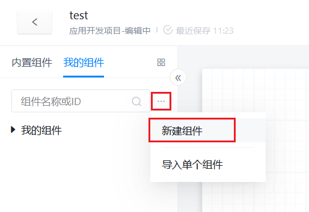

​	然后对组件名称进行填写：


填写Docker镜像为：`registry.cn-shanghai.aliyuncs.com/shuzhi-amd64/suanpan_c_sdk_example:0_0.0.1`

填写入口命令为：`/home/main`

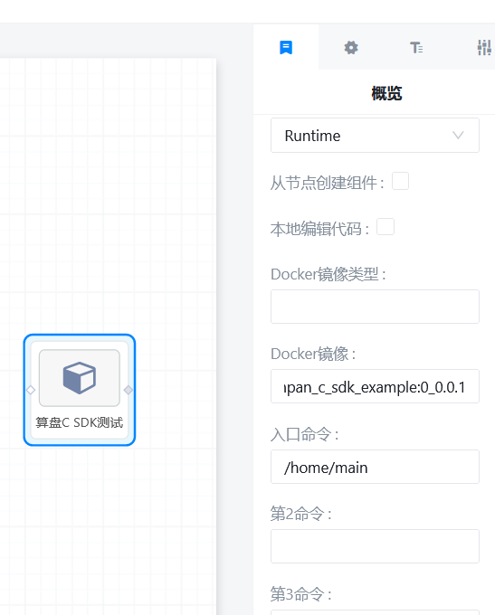


* 点击参数设置标签：

添加一个单行文本框的控件，如下所示填写：

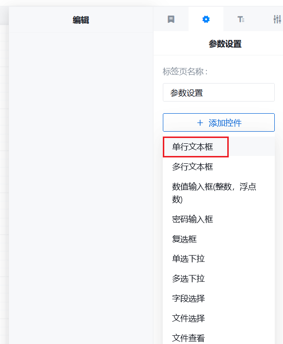

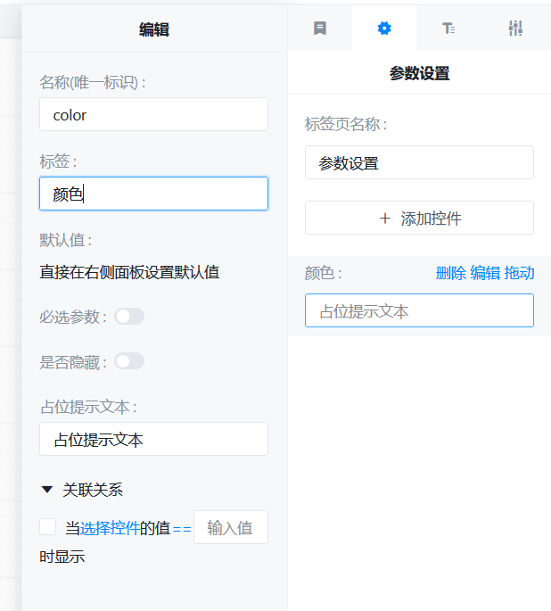

然后点击完成，组件就添加好了。


#### 5.4 测试组件环境变量功能

在左边栏目搜索此组件，则可以找到刚才做好的组件。将这个组件拖拽到画布上（画布需要处于编辑模式）。

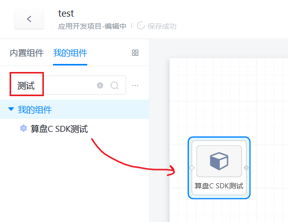

在右面板填写颜色字段为red

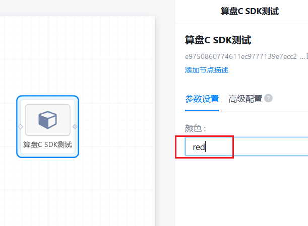

然后点击运行按钮运行。


​	运行成功后，打开日志查看

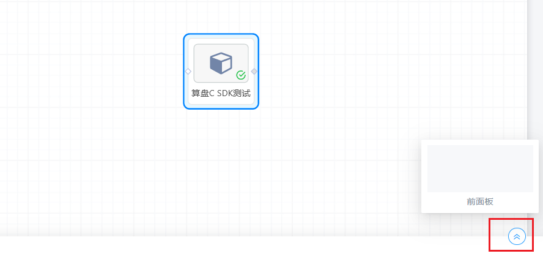


​	发现颜色red成功被读取到。


#### 5.5 测试组件消息队列功能

​	修改测试代码中main.c的`#define TEST_MODE 2` 然后就可以测试消息队列功能了。重复5.1-5.3步骤，重新在算盘上形成新的组件。


​	然后点击编辑前面板，在前面板上拖拽出2个文本框。


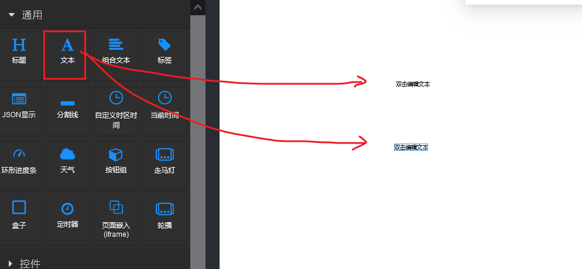


​	在测试组件加入一个输出桩。

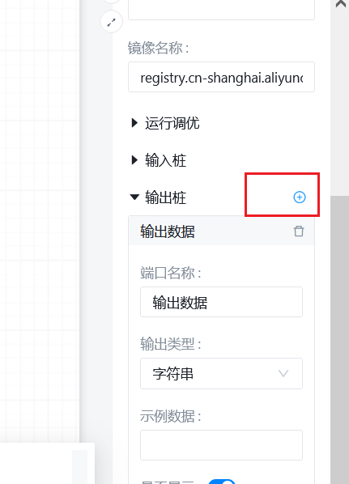

​	然后将此输出桩连接到2个显示文本。

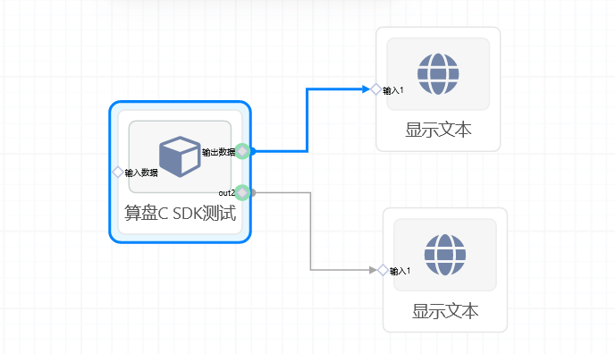

​	点击部署，然后预览前面板。


可以看到前面板上面的数据被不断输出。


​	此行为可以定位到源码的位置。同时也可以在算盘C-SDK组件前面连接一个前面板输入框进行组件输入的测试。

```c
while (1) {
	LOGD(TAG, "Trigger");
	sprintf(message, "csdk message out1 id=%d", i++); //每次发送的消息都不一样
	sp_mq_send(mq, "out1", message, NULL); //向mq发送消息
	sprintf(message, "csdk message out2 id=%d", i++); //每次发送的消息都不一样
	sp_mq_send(mq, "out2", message, NULL); //向mq发送消息
	os_sleep(10);
}
```


#### 5.6 测试组件配置文件功能

​	修改测试代码中main.c的`#define TEST_MODE 3` 然后就可以测试配置文件功能了。重复5.1-5.3步骤，重新在算盘上形成新的组件。

​	组织下面的模板，然后点击运行，运行成功后点击启动成功查看日志。

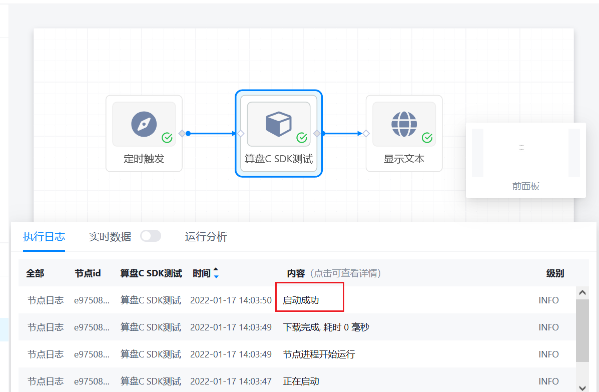

​	从日志里面可以看出定时触发的数据格式为{"count": 1, "time": "2022-01-17 14:03:52"}，配置可以被成功存储，每一次数据来的适合都会先读取上一次的配置信息。

```
2022-01-17T14:03:51.060000+08:00 [00000032][2022/1/17 06:03:51:606971][D][TEST_CONFIG]Received {"count": 1, "time": "2022-01-17 14:03:52"} from in1

2022-01-17T14:03:51.072000+08:00 [00000032][2022/1/17 06:03:51:618338][E][EXEC_CMD]program returns error
[00000032][2022/1/17 06:03:51:618355][E][MINIO_STORAGE]No result
[00000032][2022/1/17 06:03:51:618361][E][TEST_CONFIG]Load config fail ret=-1

2022-01-17T14:03:56.066000+08:00 [00000032][2022/1/17 06:03:56:612485][D][TEST_CONFIG]Received {"count": 2, "time": "2022-01-17 14:03:57"} from in1

2022-01-17T14:03:56.080000+08:00 [00000032][2022/1/17 06:03:56:626645][D][TEST_CONFIG]Load back from storage={"count": 1, "time": "2022-01-17 14:03:52"}

2022-01-17T14:04:01.088000+08:00 [00000032][2022/1/17 06:04:01:624697][D][TEST_CONFIG]Received {"count": 3, "time": "2022-01-17 14:04:02"} from in1

2022-01-17T14:04:01.101000+08:00 [00000032][2022/1/17 06:04:01:647621][D][TEST_CONFIG]Load back from storage={"count": 2, "time": "2022-01-17 14:03:57"}

2022-01-17T14:04:06.099000+08:00 [00000032][2022/1/17 06:04:06:634532][D][TEST_CONFIG]Received {"count": 4, "time": "2022-01-17 14:04:07"} from in1

2022-01-17T14:04:06.124000+08:00 [00000032][2022/1/17 06:04:06:670927][D][TEST_CONFIG]Load back from storage={"count": 3, "time": "2022-01-17 14:04:02"}
```

可以查看`test_config.c`和日志进行对应。


#### 5.7 测试组件临时文件功能

​	修改测试代码中main.c的`#define TEST_MODE 4` 然后就可以测试临时文件功能了。重复5.1-5.3步骤，重新在算盘上形成新的组件。

​	首先要把输入和输出的端口类型都改成csv文件，否则页面上会报错。。


​	组织下面的模板，然后点击运行，运行成功后点击启动成功查看日志。


​	在本地需要准备一个csv文件，内容如下：


​	点击本地的csv上传，将这个csv文件上传到组件内部。


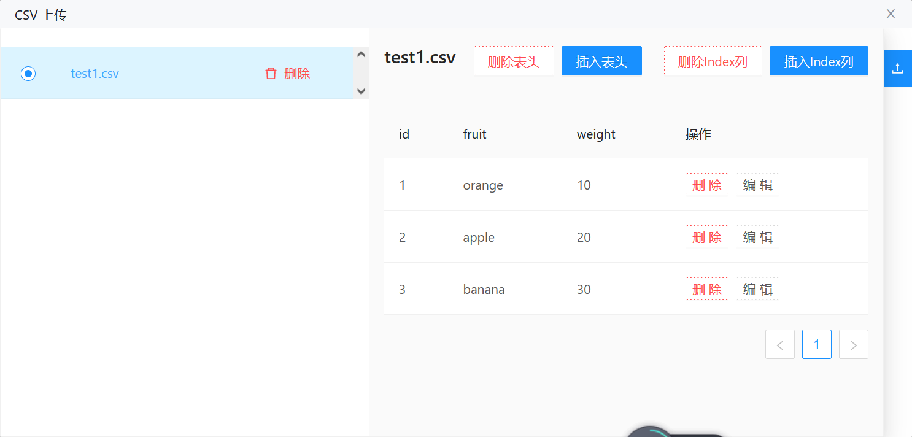

​	然后查看算盘C-SDK测试组件的日志。

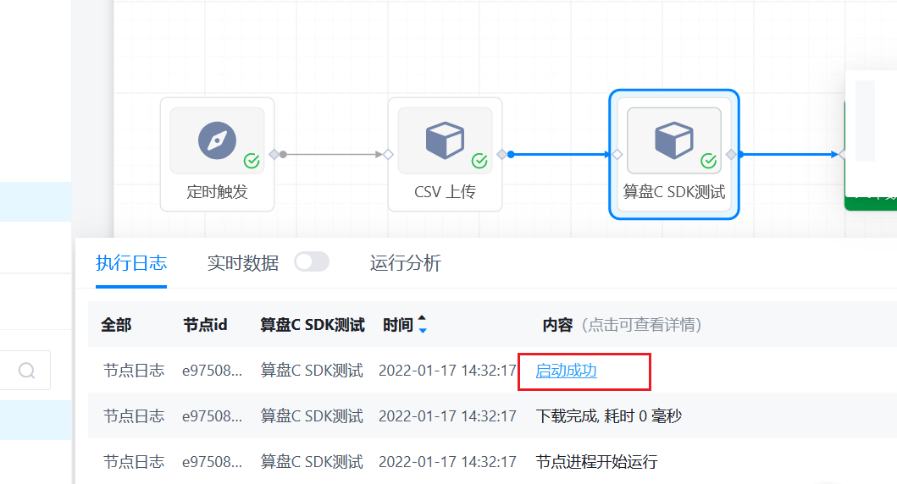

​	可以看到上一个csv文件的内容成功地在组件里面打印出来。

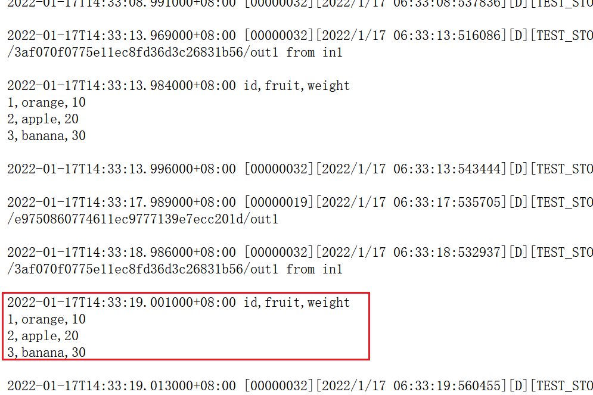


​	接下来查看文本数据导出的数据，它会持续收到算盘C-SDK测试组件输出的csv文件。

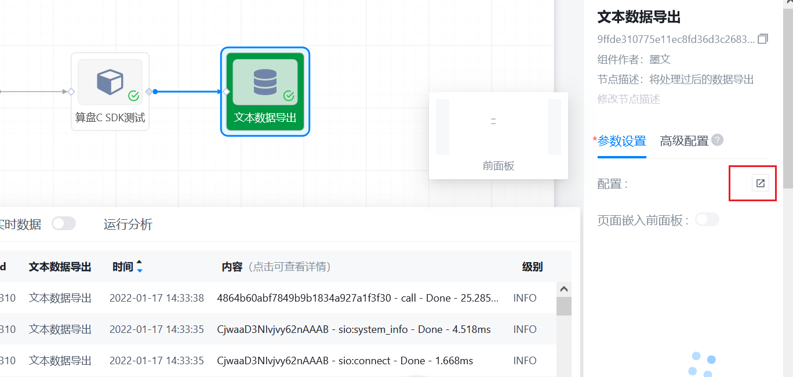


​	打开下载的内容即可了解数据是正确的。


### 6.本地适配（无算盘环境开发）

​	从`开发实例`可以看到组件从代码到算盘上的组件需要打包镜像，然后才能在算盘上面运行。为了方便本地进行调试如gdb，valgrind内存泄露检测，这里做了一个本地的适配功能，将环境变量和消息队列替换为本地的方案，从而让用户在本地也可以进行组件的调试。注意本地适配完成之后最后还需要打包docker来完成组件的开发。

#### 6.1 环境变量

​	原来在算盘上才有的右面板的环境变量，在本地运行时，被一个叫做`sp_env.ini`的文件所替代。

​	这里给出一个实例，这里定义了2个环境变量。

```bash
$ suanpan-c-sdk_x64_1.2.23/examples/suanpan/example# cat sp_env.ini 
[env]
--run_mode=myrunmode
--color=white
```

​	这里将`main.c`的TEST_MODE修改为1，然后make，运行main程序。

`	#define TEST_MODE 1`	

```bash
$ suanpan-c-sdk_x64_1.2.23/examples/suanpan/example# make
gcc -c -o main.o main.c  -fPIC  -I../../../sdk/suanpan-c-sdk/include/ -I../../..//include/
gcc  -L../../../sdk/suanpan-c-sdk/library/ -L../../..//library/ -o main main.o test_env.o test_mq.o test_storage.o test_config.o -ldl -lm -lsuanpan-c-sdk -lasound -lusb-1.0 -lmicrohttpd -lzmq -lczmq -lnanomsg -lrdkafka -lluajit-5.1

$ suanpan-c-sdk_x64_1.2.23/examples/suanpan/example# source env.sh 

$ suanpan-c-sdk_x64_1.2.23/examples/suanpan/example# ./main
[00017373][2022/1/17 07:23:38:835499][D][MAIN_TEST]test function starts
[00017373][2022/1/17 07:23:38:835578][D][TEST_ENV]test function starts
[00017373][2022/1/17 07:23:38:835615][D][TEST_ENV]Run mode=myrunmode
[00017373][2022/1/17 07:23:38:835628][D][TEST_ENV]Color=white
```

可以看到程序成功读到了这2个环境变量。


#### 6.2 消息队列

​	原来在算盘上才有的消息队列，也就是算盘模板节点之间的连线，在本地运行时，被一个windows程序所替代。

​	这里将`main.c`的TEST_MODE修改为2，然后make，运行main程序。

`	#define TEST_MODE 2`	

```
$ suanpan-c-sdk_x64_1.2.23/examples/suanpan/example# make
gcc -c -o main.o main.c  -fPIC  -I../../../sdk/suanpan-c-sdk/include/ -I../../..//include/
gcc  -L../../../sdk/suanpan-c-sdk/library/ -L../../..//library/ -o main main.o test_env.o test_mq.o test_storage.o test_config.o -ldl -lm -lsuanpan-c-sdk -lasound -lusb-1.0 -lmicrohttpd -lzmq -lczmq -lnanomsg -lrdkafka -lluajit-5.1


$ suanpan-c-sdk_x64_1.2.23/examples/suanpan/example# ./main
[00021277][2022/1/17 07:26:27:779706][D][MAIN_TEST]test function starts
[00021277][2022/1/17 07:26:27:779783][D][TEST_MQ ]test function starts
[00021277][2022/1/17 07:26:27:779793][D][SP_MQ   ]Not in suanpan environment, using fake mq
[00021277][2022/1/17 07:26:27:779796][D][SUANPAN_MQ_FAKE]SUANPAN wait on Websocket port 10000, please connect to me
[00021277][2022/1/17 07:26:27:780077][D][WEBSOCKET_SERVER]Websocket context create success
[00021277][2022/1/17 07:26:27:780209][D][TEST_MQ ]Trigger
```

可以看到日志里面`SUANPAN wait on Websocket port 10000, please connect to me`

这里需要打开windows调试程序，然后连接到这个机器的10000端口。

这个程序的文件名是`suanpan_mq.exe`

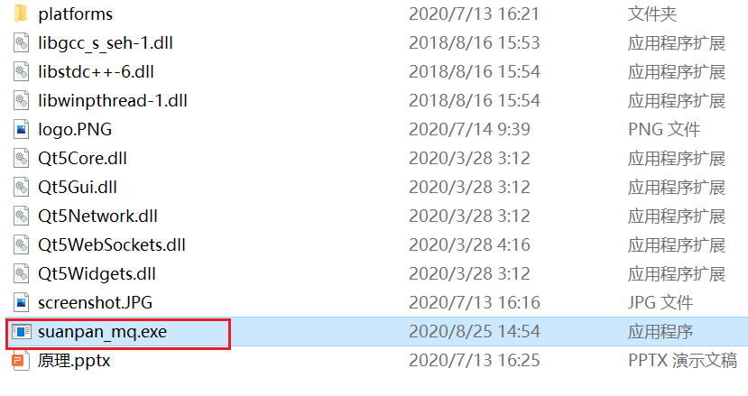

在这里需要填写正确的websocket地址，linux主机的IP地址需要填正确，然后点击连接，会显示连接的状态。

当C程序向mq发送数据的时候，数据会显示在这个软件里面，包括端口和数据。


此程序也可以向C程序发送数据，在数据发送区域输入要发送的数据，然后点击发送即可看到对应的信息。


#### 6.3 配置文件

​	原来在算盘minio上才有的配置文件，在本地运行时，被本地的configs文件夹目录所替代。

​	这里将`main.c`的TEST_MODE修改为3，然后make，运行main程序。

`	#define TEST_MODE 3`	

```bash
$ suanpan-c-sdk_x64_1.2.23/examples/suanpan/example# make
gcc -c -o main.o main.c  -fPIC  -I../../../sdk/suanpan-c-sdk/include/ -I../../..//include/
gcc  -L../../../sdk/suanpan-c-sdk/library/ -L../../..//library/ -o main main.o test_env.o test_mq.o test_storage.o test_config.o -ldl -lm -lsuanpan-c-sdk -lasound -lusb-1.0 -lmicrohttpd -lzmq -lczmq -lnanomsg -lrdkafka -lluajit-5.1

$ suanpan-c-sdk_x64_1.2.23/examples/suanpan/example# ./main
[00010586][2022/1/17 07:41:56:708029][D][MAIN_TEST]test function starts
[00010586][2022/1/17 07:41:56:708308][D][TEST_CONFIG]test function starts
[00010586][2022/1/17 07:41:56:708326][D][SP_STORAGE]not in suanpan environment, using baremental storage type
[00010586][2022/1/17 07:41:56:708332][D][SP_MQ   ]Not in suanpan environment, using fake mq
[00010586][2022/1/17 07:41:56:708337][D][SUANPAN_MQ_FAKE]SUANPAN wait on Websocket port 10000, please connect to me
[00010586][2022/1/17 07:41:56:708447][D][WEBSOCKET_SERVER]Websocket context create success
[00010587][2022/1/17 07:41:57:391472][D][WEBSOCKET_SERVER]Connection established from name=_gateway IP=10.0.2.2
[00010587][2022/1/17 07:41:57:391494][D][SUANPAN_MQ_FAKE]Client Open with fd=f4002230
[00010587][2022/1/17 07:42:21:249648][D][TEST_CONFIG]Received hello world 888 from out1

```

​	这里再通过算盘本地调试工具向程序发一个字符串，这样程序会将其保存到本地配置（config文件夹）。

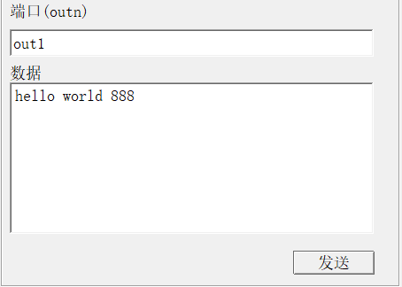

​	打开config文件夹的my8.txt查看，则可以看到配置内容。

```
$ suanpan-c-sdk_x64_1.2.23/examples/suanpan/example# cat configs/my8.txt 
hello world 888
```


#### 6.4 临时文件

​	原来在算盘minio上才有的临时文件，在本地运行时，被本地的studio文件夹目录所替代。

​	这里将`main.c`的TEST_MODE修改为4，然后make，运行main程序。

`	#define TEST_MODE 4`	

```bash
$ suanpan-c-sdk_x64_1.2.23/examples/suanpan/example# make
gcc -c -o main.o main.c  -fPIC  -I../../../sdk/suanpan-c-sdk/include/ -I../../..//include/
gcc  -L../../../sdk/suanpan-c-sdk/library/ -L../../..//library/ -o main main.o test_env.o test_mq.o test_storage.o test_config.o -ldl -lm -lsuanpan-c-sdk -lasound -lusb-1.0 -lmicrohttpd -lzmq -lczmq -lnanomsg -lrdkafka -lluajit-5.1


$ suanpan-c-sdk_x64_1.2.23/examples/suanpan/example# ./main
[00021460][2022/1/17 07:49:48:179799][D][MAIN_TEST]test function starts
[00021460][2022/1/17 07:49:48:179878][D][SP_STORAGE]not in suanpan environment, using baremental storage type
[00021460][2022/1/17 07:49:48:179882][D][SP_MQ   ]Not in suanpan environment, using fake mq
[00021460][2022/1/17 07:49:48:179885][D][SUANPAN_MQ_FAKE]SUANPAN wait on Websocket port 10000, please connect to me
[00021460][2022/1/17 07:49:48:179972][D][WEBSOCKET_SERVER]Websocket context create success
[00021460][2022/1/17 07:49:48:180185][D][TEST_STORAGE]Send path=studio/93b4cf63480944b0a8d707f1debacccf/out1
[00021461][2022/1/17 07:49:48:768801][D][WEBSOCKET_SERVER]Connection established from name=_gateway IP=10.0.2.2
[00021461][2022/1/17 07:49:48:768833][D][SUANPAN_MQ_FAKE]Client Open with fd=44002230
[00021460][2022/1/17 07:49:58:192315][D][TEST_STORAGE]Send path=studio/18aeb29d4eee4803be5b0863c4491c97/out1
```

​	可以查看到本地的临时文件内容

```
$ suanpan-c-sdk_x64_1.2.23/examples/suanpan/example# cat studio/18aeb29d4eee4803be5b0863c4491c97/out1/data.csv 
id,name,age
1,Alice,18
2,Bob,19
```

### 7.附件

 [suanpan_mq_release_v0.3.zip](data/suanpan_mq_release_v0.3.zip) 

 [suanpan-c-sdk_x64_1.2.24.tar.gz](data/suanpan-c-sdk_x64_1.2.24.tar.gz) 