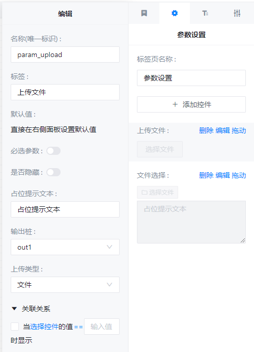
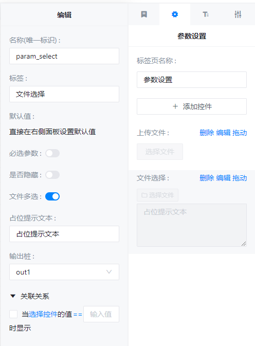

# 文件上传

## 组件右面板配置

要让一个组件能够接收上传的文件，需要配置两个参数：`上传文件`和`选择文件`。`上传文件`能够上传文件到算盘模板，`选择文件`指定当前组件需要的文件名称。

配置一个`上传文件`参数

<figure markdown>
  
</figure>

配置一个`选择文件`参数

<figure markdown>
  
</figure>

## 组件代码

```python
import suanpan
import os
from suanpan.app import app
from suanpan.app.arguments import Json, Folder, ListOfString
from suanpan.log import logger


@app.afterInit
def init(context):
    args = context.args
    logger.info(f'hello upload: {args}')
    for filename in args.param_select:
        file = os.path.join(args.param_upload, filename)
        logger.info(f'file {file} exist: {os.path.isfile(file)}')


@app.input(Json(key="inputData1", alias="user_text", default="Suanpan"))
@app.param(Folder(key="param_upload", alias="param_upload"))
@app.param(ListOfString(key="param_select", alias="param_select"))
@app.output(Json(key="outputData1", alias="result"))
def hello_world(context):
    args = context.args
    logger.info(f'hello world: {args}')

    return f'Hello World, {args.prefix} {args.user_text}!'


if __name__ == "__main__":
    suanpan.run(app)
```

1. `param_upload` 是`上传文件`的路径，`param_select` 对应的是`文件选择`
2. 组件启动之后会自动把上传的文件下载到容器本地，开发者需要做的就是在 init 函数里读取、处理所需文件
